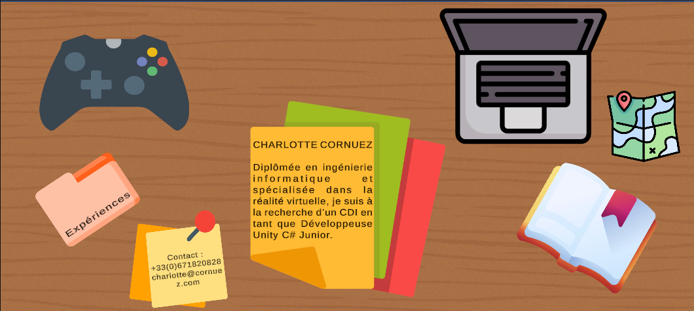
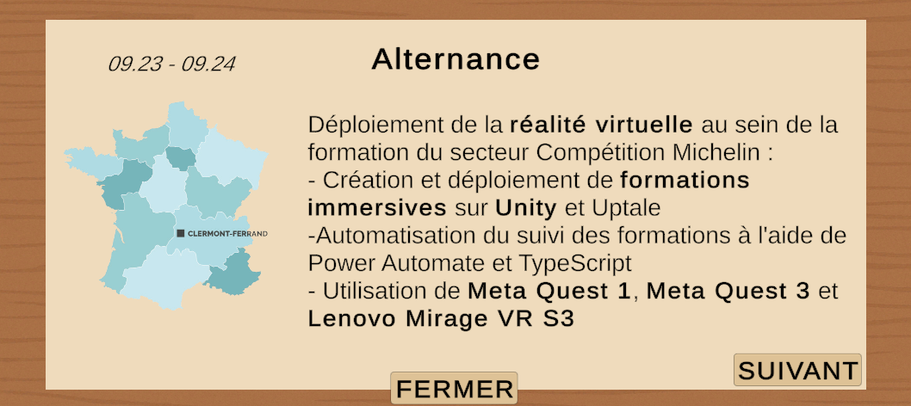
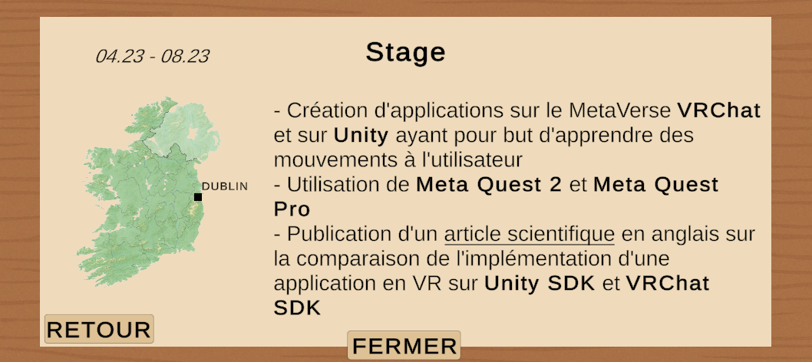


# Réalisation d'un CV à l'aide d'Unity

  

  

[English below ↓↓↓↓](#the-project)

  [En cours de création]

## Le projet

  

  

Ce projet a pour but de créer mon CV en 2D de manière plus attractive qu'un CV sous format pdf. Le but est de créer un CV qui sera accessible directement sur le web en utilisant la partie WebGL d'Unity.

  

  

## Installation

  

  

Pour utiliser ce projet, il faut :

- Installer [Unity][hub];

- Cloner ou télécharger le git;

- Ouvrir le projet avec Unity;

  

Vous pourrez aussi directement voir le projet en cliquant sur ce lien lorsque la page web sera déployée.

  

  

## Intéraction

  

  
  L'interaction se fait en cliquant directement sur les différents éléments présents en 2D ou en appuyant directement sur les boutons.
  

  

## Dépendances et paramètres

  

  

Version d'Unity : [6.0.38f1][unityversion] 

 

  

## Ce que j'ai appris

  
  

- Amélioration de l'utilisation d'Unity 2D

- Amélioration de l'utilisation de l'UI

- Utilisation de balises dans les textes

- Implémentation de lien dans les textes

  

  

---

  [In progress]

## The Project

  

  

The goal of this project is to create my 2D résumé in a more attractive way than a traditional PDF format. The idea is to develop a CV that will be accessible directly on the web using Unity's WebGL feature.

  

## Installation

  

To play this project, you need to:

- Install [Unity][hub].

- Clone or download this repository to your local machine.

- Open Unity and click "Open".

  

You will also be able to view the project directly by clicking on this link once the web page is deployed.

  

## Interaction

  
  
The interaction is done by directly clicking on the various 2D elements or by pressing the buttons.
  

## Dependencies and Settings

  

  

Unity Version: [6.0.38f1][unityversion] 

  

## What I Learned

  

- Improved use of Unity 2D

- Improved use of the UI system

- Use of tags in text elements

- Implementation of links within text

  

[unityversion]: <https://unity.com/fr/releases/editor/whats-new/6000.0.38#notes>

  

[porte]: <https://assetstore.unity.com/packages/3d/props/interior/free-wood-door-pack-280509>

  

[keypad]: <https://assetstore.unity.com/packages/3d/props/electronics/keypad-free-262151>

  

[chambre1]: <https://assetstore.unity.com/packages/3d/props/furniture/big-furniture-pack-7717>

  

[chambre2]: <https://assetstore.unity.com/packages/3d/environments/minimalist-archviz-bedroom-131093>

  

[poubelle]: <https://assetstore.unity.com/packages/3d/props/furniture/trash-bin-96670>

  

[livres]: <https://assetstore.unity.com/packages/3d/props/interior/qa-books-115415>

  

[pc]: <https://assetstore.unity.com/packages/3d/props/pks-laptop-low-264665>

  

[meta]: <https://www.meta.com/fr-fr/help/quest/1517439565442928/?srsltid=AfmBOopkSjnjqp4WxYa2_saKjVrcXnT893FLHjNIZw3kS3YSjOKN6O2I>

  

[hub]: <https://unity.com/download>

[chambre3]:<https://assetstore.unity.com/packages/3d/environments/apartment-kit-124055>

[light]:<https://assetstore.unity.com/packages/3d/props/interior/casual-light-pack-303168>
